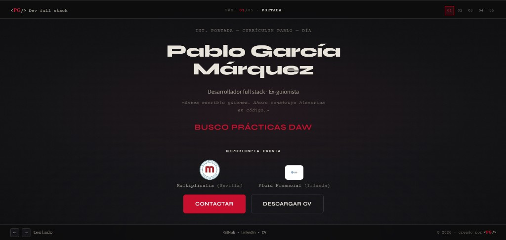
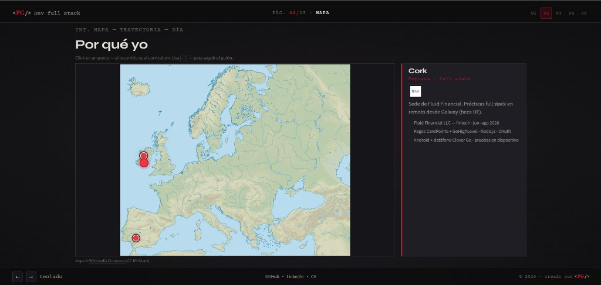
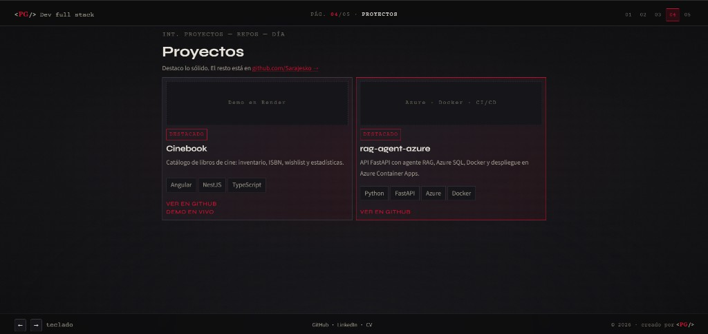
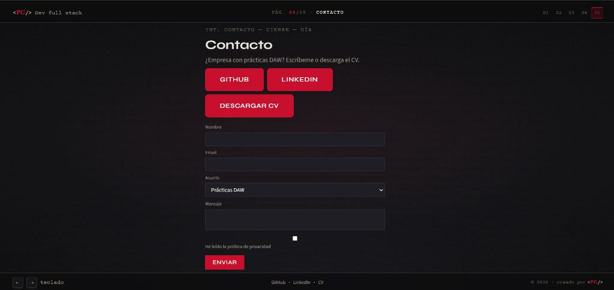

# Página web personal — Pablo García Márquez

Web personal / portfolio con metáfora de **guión** (**5 escenas**, scroll lateral), **mapa = currículum**, y backend full stack (FastAPI + SQLite + admin).

**Autor:** Pablo García Márquez  
**Repositorio:** [github.com/Sarajesko/pagina-web-personal](https://github.com/Sarajesko/pagina-web-personal)  
**LinkedIn:** [linkedin.com/in/pablogarciamarquez](https://www.linkedin.com/in/pablogarciamarquez)  
**Demo online (estático):** [sarajesko.github.io/pagina-web-personal/frontend](https://sarajesko.github.io/pagina-web-personal/frontend/)  
**Demo full stack (recomendado):** VPS Hetzner — ver [Deploy en Hetzner](deploy/hetzner.md)

---

## Deploy en Hetzner (recomendado)

Una URL siempre encendida (sin cold start): **Caddy + Docker** sirven API, portfolio y admin. Guía completa: [`deploy/hetzner.md`](deploy/hetzner.md).

Resumen:

1. Crear VPS Ubuntu (CAX11 o CX22) y abrir puertos 22/80/443.
2. Instalar Docker, clonar el repo, copiar `deploy/env.example` → `.env`.
3. `docker compose up -d --build`
4. Portfolio: `https://TU_DOMINIO/frontend/` · Admin: `/frontend/admin/`

## Deploy en Render (alternativa)

Un solo servicio Docker (mismo `Dockerfile`). El plan **free se duerme**; para producción preferir Hetzner o Render Starter.

1. [Render](https://dashboard.render.com) → Blueprint / Web Service Docker → `render.yaml` o `Dockerfile`.
2. Variables: `ADMIN_*`, `CORS_ORIGINS`, `SESSION_*` (ver `render.yaml`).
3. URLs: `https://<servicio>.onrender.com/frontend/`

Si usas Pages + API Render, actualiza `PRODUCTION_API` en `frontend/js/config.js`.

---
## Índice

1. [Capturas de pantalla](#capturas-de-pantalla)
2. [¿Para qué sirve?](#para-qué-sirve)
3. [Qué incluye](#qué-incluye)
4. [Las 5 escenas](#las-5-escenas)
5. [Estructura del repo](#estructura-del-repo)
6. [Requisitos](#requisitos)
7. [Arranque rápido](#arranque-rápido)
8. [Frontend](#frontend)
9. [Backend (API)](#backend-api)
10. [API REST](#api-rest)
11. [Ejemplos curl](#ejemplos-curl)
12. [Panel admin](#panel-admin)
13. [Tests](#tests)
14. [Postman](#postman)
15. [Stack y arquitectura](#stack-y-arquitectura)
16. [Solución de problemas](#solución-de-problemas)
17. [Próximos pasos](#próximos-pasos)
18. [Autor y derechos](#autor-y-derechos)

---

## Capturas de pantalla

### 01 · Portada



### 02 · Mapa (currículum)



### 04 · Proyectos



### 05 · Contacto



---

## ¿Para qué sirve?

Portfolio con personalidad para **prácticas DAW** (módulo superior), sin esconder el contenido:

- trayectoria en **escenas** (páginas de un guión), sin scroll vertical por escena;
- el **mapa de Europa es el currículum** (Sevilla / Galway / Cork);
- esta misma web como prueba **full stack** (API, SQLite, panel admin);
- proyectos destacados + formulario de contacto en BD.

**Invitados** ven todo (proyectos incluidos) y los enlaces a GitHub / LinkedIn / CV.  
**No hay registro de usuarios** en v1: solo login de administrador (Pablo).

---

## Qué incluye

| Área | Estado |
|------|--------|
| Front HTML/CSS/JS — scroll lateral tipo guión | Listo |
| **5 escenas** (portada, mapa, este proyecto, proyectos, contacto) | Listo |
| Mapa Europa interactivo = currículum (SVG + puntos) | Listo |
| Layout viewport-fit (sin scroll vertical por escena) | Listo |
| Favicon `<PG/>` / CV descargable | Listo |
| Responsive (móvil) | Listo |
| API FastAPI + SQLite | Listo |
| `POST /api/contact` — mensajes en BD | Listo |
| `GET /api/projects` — proyectos públicos | Listo |
| Auth admin (sesión cookie) + CRUD proyectos | Listo |
| Panel admin (mensajes + proyectos) | Listo |
| Tests de integración API (`13/13`) | Listo |
| Colección Postman | Listo |
| Open Graph / SEO / deploy público | Pendiente |

---

## Las 5 escenas

| # | Escena | Contenido |
|---|--------|-----------|
| 01 | **Portada** | Nombre, ask *Busco prácticas DAW*, experiencia previa, CTAs |
| 02 | **Mapa** | Sevilla / Galway / Cork — el recorrido es el CV |
| 03 | **Este proyecto** | Esta web como prueba full stack (API, SQLite, admin) |
| 04 | **Proyectos** | Destacados (Cinebook, rag-agent-azure) + enlace a GitHub |
| 05 | **Contacto** | Formulario (asunto DAW por defecto) + GitHub / LinkedIn / CV |

Navegación: rueda / teclado `←` `→` / números del header. En el mapa, click en los puntos rojos.

---

## Estructura del repo

```
pagina-web-personal/
├── frontend/                 Web pública + panel admin (HTML/CSS/JS)
│   ├── css/
│   ├── js/
│   ├── admin/                Login admin · mensajes · proyectos
│   └── index.html
├── backend/                  FastAPI + SQLite
│   ├── app/                  Routers, models, auth, validators
│   ├── instance/             portfolio.db (gitignored)
│   ├── schema.sql · seed.sql
│   ├── init_db.py · run.py · test_api.py
│   ├── requirements.txt
│   └── .env.example
├── assets/
│   ├── cv/                   PDF del CV
│   ├── favicon/              Iconos del sitio
│   ├── logos/                Ilerna, CORE, Multiplicalia, Fluid…
│   ├── projects/             Capturas / slots de proyectos
│   └── maps/                 SVG Europa relieve
├── content/                  Textos (mapa, copy)
├── docs/
│   ├── screenshots/          Capturas del README
│   └── …                     Wireframe, design tokens
├── postman/                  Colección API
└── README.md
```

| Carpeta / archivo | Rol |
|-------------------|-----|
| `frontend/` | View pública + admin |
| `backend/` | API FastAPI + SQLite |
| `assets/` | Logos, mapa, CV, favicon |
| `docs/` | Diseño, wireframe, capturas |
| `postman/` | Colección para probar la API |

---

## Requisitos

| Herramienta | Para qué |
|-------------|----------|
| **Python 3.11+** | API FastAPI |
| Navegador moderno | Chrome / Edge / Firefox / Safari |
| Servidor estático local (opcional) | Live Server, `npx serve`, etc. para el front |
| **Postman** (opcional) | Probar la API |

---

## Arranque rápido

Dos procesos en local: **API** + **front**.

### 1. Backend

```bash
cd backend
python -m venv venv

# Windows
venv\Scripts\activate
# macOS / Linux
# source venv/bin/activate

pip install -r requirements.txt
copy .env.example .env          # Windows
# cp .env.example .env          # macOS / Linux

# Edita .env: SECRET_KEY, ADMIN_PASSWORD (no uses los defaults en serio)
python init_db.py
python run.py
```

| Recurso | URL |
|---------|-----|
| API | [http://127.0.0.1:5000](http://127.0.0.1:5000) |
| Health | [http://127.0.0.1:5000/api/health](http://127.0.0.1:5000/api/health) |
| Swagger | [http://127.0.0.1:5000/docs](http://127.0.0.1:5000/docs) |

Detalle de variables: [`backend/.env.example`](backend/.env.example) y [`backend/README.md`](backend/README.md).

### 2. Frontend

Abre el front con un servidor local (para que `fetch` y rutas relativas funcionen bien):

```bash
# desde la raíz del repo, por ejemplo:
npx --yes serve frontend -p 5500
```

O usa la extensión **Live Server** sobre `frontend/index.html`.

| Recurso | Valor |
|---------|--------|
| Web | p. ej. [http://127.0.0.1:5500](http://127.0.0.1:5500) |
| API por defecto | `http://127.0.0.1:5000` |

En producción, antes de los scripts del front:

```html
<script>window.PORTFOLIO_API = "https://tu-api.onrender.com";</script>
```

---

## Frontend

Metáfora: **páginas de un guión** (scroll horizontal / 5 escenas). Cada escena cabe en el viewport (sin scroll vertical interno).

Incluye:

- portada con ask DAW, logos de experiencia previa y descarga de CV;
- mapa interactivo (Sevilla, Galway, Cork) como currículum;
- escena «este proyecto» (stack de esta web);
- proyectos destacados vía API + enlaces a GitHub / demos;
- contacto (formulario + redes);
- panel en `frontend/admin/`.

---

## Backend (API)

- **FastAPI** + **SQLite** (`contact_messages`, `projects`, `admin_users`).
- Sesión admin por **cookie** (`credentials: "include"`).
- Errores JSON coherentes: `400` / `401` / `404` / `500` (`app/errors.py`).

Documentación ampliada: [`backend/README.md`](backend/README.md).

---

## API REST

Prefijo: `/api`. Auth admin = cookie de sesión tras login.

| Método | Ruta | Auth | Descripción |
|--------|------|------|-------------|
| GET | `/api/health` | No | Estado API + BD |
| POST | `/api/contact` | No | Guardar mensaje |
| GET | `/api/projects` | No | Proyectos publicados |
| POST | `/api/admin/login` | No | Login admin |
| GET | `/api/admin/me` | Sí | Sesión actual |
| POST | `/api/admin/logout` | Sí | Cerrar sesión |
| GET / POST | `/api/admin/projects` | Sí | Listar / crear |
| PUT / DELETE | `/api/admin/projects/{id}` | Sí | Editar / borrar |
| GET | `/api/admin/messages` | Sí | Mensajes de contacto |
| PATCH | `/api/admin/messages/{id}` | Sí | Marcar leído |

---

## Ejemplos curl

```bash
# Health
curl -s http://127.0.0.1:5000/api/health

# Proyectos públicos
curl -s http://127.0.0.1:5000/api/projects

# Contacto
curl -s -X POST http://127.0.0.1:5000/api/contact \
  -H "Content-Type: application/json" \
  -d "{\"name\":\"Ana\",\"email\":\"ana@empresa.com\",\"subject\":\"practicas-daw\",\"message\":\"Hola Pablo\",\"privacy\":true}"

# Login admin (guarda cookie)
curl -s -c cookies.txt -X POST http://127.0.0.1:5000/api/admin/login \
  -H "Content-Type: application/json" \
  -d "{\"username\":\"admin\",\"password\":\"changeme\"}"

# Mensajes (con sesión)
curl -s -b cookies.txt http://127.0.0.1:5000/api/admin/messages
```

---

## Panel admin

1. API en marcha (`python run.py`).
2. Abre `frontend/admin/index.html` con el mismo origen/servidor local que uses para el front.
3. Login con `ADMIN_USERNAME` / `ADMIN_PASSWORD` del `.env`.
4. Pestañas: **Mensajes** y **Proyectos** (CRUD).

---

## Tests

```bash
cd backend
python test_api.py
```

Suite de integración (BD temporal + lifespan): health, estáticos, contacto↔admin, CRUD proyectos, auth, CORS y errores. Esperado: **`OK` — 21 tests**.

---

## Postman

Importa [`postman/portfolio-api.postman_collection.json`](postman/portfolio-api.postman_collection.json). Tras `POST /api/admin/login`, la cookie se reutiliza en rutas admin.

---

## Stack y arquitectura

| Capa | Tecnología |
|------|------------|
| View | HTML · CSS · JavaScript vanilla (scroll lateral, mapa) |
| Controller | FastAPI · validación · sesión cookie |
| Model | SQLite (SQL) |

Arquitectura clara: modelos SQL · routers FastAPI · front estático.

---

## Solución de problemas

| Problema | Qué revisar |
|----------|-------------|
| Front no carga proyectos / contacto falla | API en `:5000`; CORS; consola del navegador |
| Admin 401 | Login hecho; cookies habilitadas; mismo host que la API en local |
| `init_db.py` / login no funciona | `.env` creado; `ADMIN_PASSWORD` coherente; vuelve a ejecutar `init_db.py` |
| Tests fallan | Ejecutar desde `backend/` con venv y deps instaladas |
| CORS en producción | No uses `*`; pon el dominio real del front en `CORS_ORIGINS` |

---

## Próximos pasos

- Meta Open Graph / SEO y deploy público (front + API).
- Enlazar la demo desde LinkedIn.
- Capturas / demos en vivo de más proyectos (p. ej. Cinebook).

---

## Autor y derechos

**Autor:** Pablo García Márquez ([@Sarajesko](https://github.com/Sarajesko)).

© Pablo García Márquez. Ver [LICENSE](LICENSE).

El código y el diseño se publican en GitHub para **mostrar el trabajo** (prácticas DAW / portfolio).  
**Sí puedes redistribuir** el proyecto (p. ej. compartir el repo o una copia sin cambios), manteniendo la autoría de Pablo.  
**No** está permitido modificarlo y presentarlo como propio, ni reutilizar partes sustanciales en otro portfolio/comercial, sin autorización del autor.
